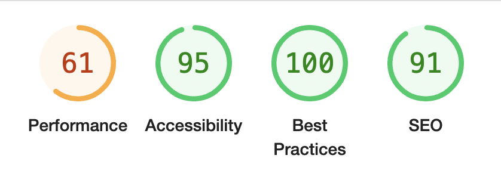
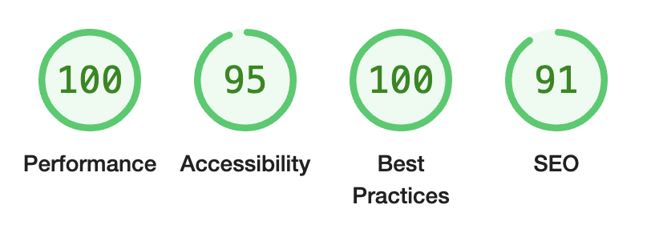
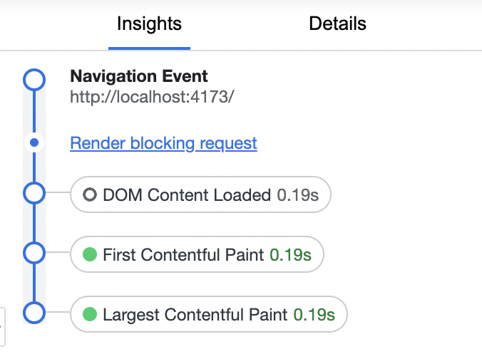
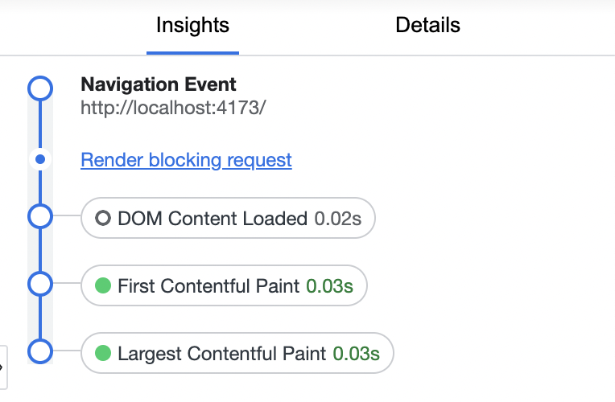

# atlan-mock-task

Mock task from [Atlan](https://atlan.com/).
Here's the original [statement](https://atlanhq.notion.site/Task-Atlan-Frontend-Engineer-80ca8e35cc694e31bfd6b415d328269c).


## Overview

This is an SQL query viewer:
- it takes a query
- sends it to the *fake server*
- and displays the response (supporting unlimited amount of data due to list virtualization)
- keeps a history of queries requested so that the user can switch between them

It implements the best practices for working with large data sets:
- virtual list render
- and lazy data loading technique

## 1. Decomposition

Basic blocks:
- **data source** and **API client** wrapping it
- **input field** for SQL query
- **table** component rendering the data
- **tabs or dropdown** for switching between queries

The statement offers brownies for rendering large amount of rows. It brings 2 extra points:
- the API must support **chunking mechanism** and provide large amount of data. So rather than use those CSVs we generate data of any size using fakerjs.
- we have to **virtualize** the table (for example, using VueUse)


## 2. Stack

Scaffolding the project with `npm init vue@latest`.

- [Vue 3](https://vuejs.org/) for rendering
- [Typescript](https://www.typescriptlang.org/) (as always)
- [Pinia](https://pinia.vuejs.org/) for state management
- [VueUse](https://vueuse.org/) for having ready-to-go composables
- [Faker](https://fakerjs.dev/) for mocking the server


## 3. Mocking the server

This part is a bit troublesome because usually in frontend we go to a backend team and take an API contract (OpenAPI or GraphQL scheme) to generate both API client and types.

Now we have to do it manually.

The server must provide chunking interface so I assume the following API:


```ts

type ID = string

interface Identified {
  id: ID
}

/**
 * We don't need any validation on the client side,
 * but even if we do it should run on the server.
 * So we have no types regarding SQL tables on the front.
 * The server owns all the data types, the client side knows
 * nothing about SQL schemes actual tables and structures.
 *
 * That's why `Item` maps to values of type `any`.
 *
 * The only thing we require is `Identified` contract.
*/
type Item = Identified & Record<string, any>


type Response<T> = Promise<ResponseSqlSelect<T> | ApiError>

type ResponseSqlSelect<T> = {
  /**
   * This is a total length of the data matching a given query.
   * The server should provide it because we load data by chunks
   * and therefore have no any information about the total data size
   * we are querying.
  */
  length: number

  /** I expect the server to send the table headers as well.
   * For relying on the data itself isn't safe, because
   * there could be optional fields
   * */
  keys: (keyof T)[]

  /** Chunk of data matching a given query */
  data: T[]
}

type API = {
  getData: ({ query:  string, from: ID, to: ID, limit: number }) => Response<Item>
}

```

Data itself comes from Faker.

The **fake server** supports 3 tables: users, tasks, posts.
And it maps a query to fixed random seed for samples to be consistent
between calls.


## 2. Virtual table

I'm using `useVirtualList` from VueUse to virtualize the *tbody* part of the table.
But this particular implementation uses wrappers around the target element,
so here we are trading off semantics.

Table interface:
```ts
type Props = {
  items: Item[]
  keys: string[]

  /**
   * We have to track an event when the bottom of the table entering viewport
   * to support lazy loading technique.
   **/
  trackBottom?: boolean

  /** We need this state to decide whether the data is fully loaded
   * or there are chunks waiting on the server.
  */
  exhausted: boolean
}
```
## 3. `History` feature

I've picked Pinia for the project as a stare management solution because it's easy-to-use and modern.

The `history` feature provides a user with a sidebar showing their previous queries to switch between them at any time.

This is implemented as a sidebar because it has higher UX than a dropdown or tabs.

## Performance metrics

In Lighthouse the app hits only 61 points because of the FakerJS (2.5MB of minified code)

With a real server it would hit 100 points.

### Lighthouse perf score (with faker)



### Lighthouse perf score (without faker)


However in the more realistic tests (Chrome Performance insights) the page load is totaly ok:

### Performance insights (with faker)


### Performance insights (without faker)



In-depth JSON reports can be found in [page-load-metrics](./page-load-metrics/) directory.
